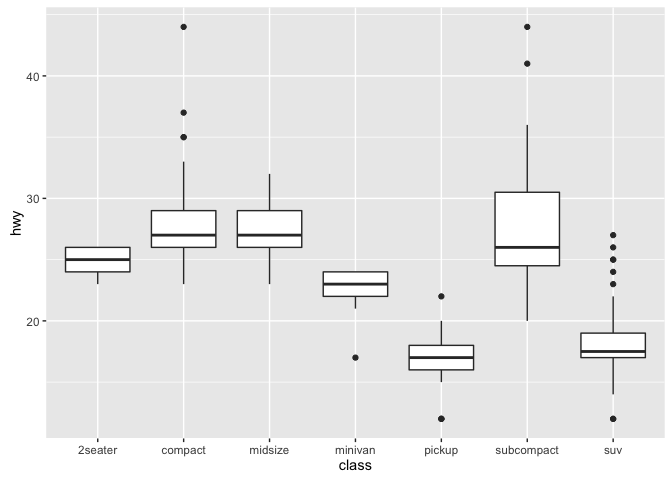

Markdown tutorial part 2
================

Including Code
--------------

You can include R code in the document as follows:

``` r
summary(cars)
```

    ##      speed           dist       
    ##  Min.   : 4.0   Min.   :  2.00  
    ##  1st Qu.:12.0   1st Qu.: 26.00  
    ##  Median :15.0   Median : 36.00  
    ##  Mean   :15.4   Mean   : 42.98  
    ##  3rd Qu.:19.0   3rd Qu.: 56.00  
    ##  Max.   :25.0   Max.   :120.00

Including Plots
---------------

You can also embed plots, for example:

<!-- -->

Or if you have multiple plots:

    ## Sales Report {.tabset}
     
    ### By Product
     
    (tab content)
     
    ### By Region
     
    (tab content)

Multiple plots
--------------

### By class

``` r
g <- ggplot(mpg, aes(class))
# Number of cars in each class:
g + geom_bar()
```

<!-- -->

### Boxplot

``` r
p <- ggplot(mpg, aes(class, hwy))
p + geom_boxplot()
```

<!-- -->
