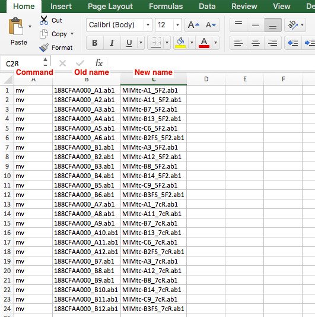

#Sanger Sequencing and sequence assembly

##PCR and clean up

[**ExoSAP-IT (affymetrix)**](http://www.affymetrix.com/catalog/131310/USB/ExoSAP-IT+For+PCR+Product+Cleanup#1_1)

-   500 reactions costs $413
-   5 µL of PCR + 2 µL of ExoSAP-IT
-   15 min at 37C followed by 15 min at 80ºC

[**Homemade Exo SAP mix (Protocol)**](PCR_clean-up.md)

-   Different protocols online for cleaning
-   Lower concentration of enzymes
-   Longer incubation times

**Spin column**

-   [Promega – Wizard gel and PCR clean-up system 250 preps $450](https://www.promega.com/products/dna-purification-quantitation/dna-fragment-purification/wizard-sv-gel-and-pcr-clean\_up-system/)
-   [NEB - Monarch PCR & DNA Cleanup Kit 250 preps $455](https://www.neb.com/products/t1030-monarch-pcr-dna-cleanup-kit-5-ug)

## Sample prep and submission

- [Protocol for macrogen submission](Submission_macrogen.md)
- [Submission form for MSU RTSF](https://rtsf.natsci.msu.edu/genomics/forms/general-sanger-submission-form/)

## Sequence pre-processing
First thing to do is to generate a  master file with original names (e.g. 188CFAA000_A1.ab1) to the actual name:

- MIMtc-A1_5F2.ab1:
    - MIMtc => Location
    - A1 => Field location
    - 5F2 => Primer
    - .ab1 => file type (e.g. ab1 or scf)


- C-INSO2_1-14~R.0814-3.scf:
    - C => media type
    - INSO2 => state and year
    - 1-14 => field and isolate number
    - R => direction (F or R)
    - 0814-3 => plate number
    - scf => file type

**Keep a copy of your raw sequences in case if something goes wrong**

### Renaming files in windows

Create a master file in excel or other spreadsheet software


then go to command prompt on windows:


and copy and paste the data in the excel file and it should be done.
[4 way to rename files in windows](http://www.howtogeek.com/111859/how-to-batch-rename-files-in-windows-4-ways-to-rename-multiple-files/)

### Renaming files in mac

- Create a master file in excel or other spreadsheet software




- then go to terminal on mac:


- Copy and paste the command on the terminal.  

If you want to be more geeky there are two options:

1. Create a bash file with the info in the excel and save it as `5-7Rename.sh` like [this](seqs/5-7Rename.sh) and then run within the folder:
```
sh 5-7Rename.sh
```

2. Create a master file with two columns (tab-separated) and then using **bash** in unix
```
awk -F',' '{print("mv \"" $1 "\" \"" $2 "\"")}' test.txt | /bin/bash
```

## Assembling sequences
There are different options for sequence assembly:
  
  - DNASTAR Lasergene (License require; GUI)
  - CLC Main workbench (License require; GUI)
  - Geneious (License require; GUI)
  - Phred, Phrap and consed (Free, but need register; command line)
  - CAP3 (Free, command line)
  - UGENE (Free, uses CAP3; GUI)
  - **Codoncode aligner (License require; GUI)**
  - Bioedit (Free, CAP3 plugin)
  - Chromaseq (Free, plugin within mesquite)

### Codoncode aligner
Usually in Chilvers lab we used **codoncode aligner** and there are tutorials for [sequence assembly](http://www.codoncode.com/aligner/tutorials/Assemble_in_groups_by_name.swf), and other [features](http://www.codoncode.com/aligner/tutorials/).

**Codoncode aligner uses a floating license in our lab, so only one computer can use it at the time, please shut it down if you are done with the analysis**

- Here is detailed [pdf file](assembly_codoncode.pdf) that I put together with the step-by-step to assemble sequences

### UGENE

UGENE has a workflow to assemble sequences but it requires reference sequences.


UGENE also has a manual asssembly that could be useful:

1. Open UGENE and go to the **tools** menu and select **sanger data analysis** and click on contig assembly with CAP3


2. A window will pop up asking for the **ab1** files to assemble, just click **add** and slected the files to assemble


3. You can just click **run** to obtain your contig assembly (ACE file) or you can select the **advanced** tab to modify parameters


4. Then you can evaluate your assembly, but you won't have access to the chromatogram files (or at least I think so)


## Sequencing Errors

- [Common sequencing errors and how to troubleshoot](Common_sequencing_errors.pdf)

