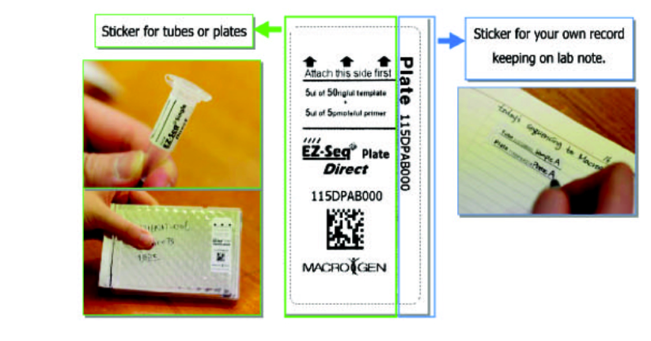

***Submission to Macrogen USA for sequencing***
  
  <http://www.macrogenusa.net/>
  
1.  **Order labels for plates or single tubes **
  
  -   [Request pre-paid labels “EZ-seq”](https://www.macrogenusa.com/order/ezseq/ezseq_step1.jsp)
  -   EZ-seq labels will be delivered to the lab 2-3 days after.
  -   An invoice will be generated for each order of labels, make sure
that we are up to date on the account.

2.  **Sample preparation for EZ-seq**
 
- Clean PCR products and primer add up to ~12 µL per reaction.
    - 6 µL PCR product
    - 3 µL H2O
    - 3 µL primer (10µM)

- For plates:
    - To avoid potential damage, please use out-skirted well plate.
    - Strip caps are recommended to seal 96-well plates.
    - Carefully seal the 96 well plates with strip caps.

- For tubes:
    - Use 1.5 mL tubes to place your sample
    - In this case, each sample will take two tubes if the target is going to be sequence in two directions.
    - Place tubes on a Ziploc bag.

{width="4.874561461067366in"
height="2.8303576115485565in"}

3.  **Shipment to Macrogen**
  
  -   Shipment will be covered by macrogen if you have more than 20
samples, otherwise you have to provide an account number.
  -   *Macrogen FedEx Account #111-534-365*
  -   Select delivery type as "**Standard Overnight**". Dry ice or ice packs are not necessary in the shipment.
  -   Address:
  
  > MacrogenUSA\
  > Maryland Technology Development Center \
  > 1330 Piccard Drive \
  > Rockville MD 20850 USA\
  > Tel. (301) 251-1007
